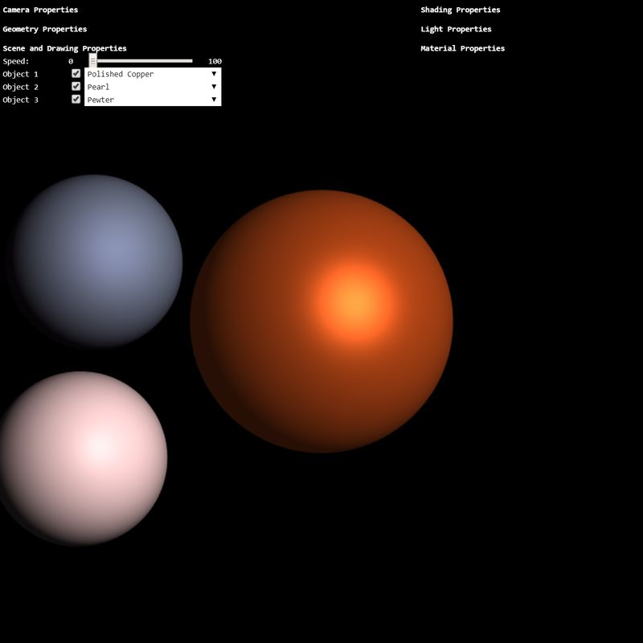

# New Jersey Institute of Technology: CS 438  
Interactive Computer Graphics

## Assignment 3

Due: **Thursday, 11/12/2020, 11.59pm**  

Go to: [Assignment Home](assignment3.html) | [Tasks](task3.html)

Author: Last Name, First Name, Student Number

### TASKS

There are 3 Tasks. The html-js file pair is named accordingly: (task3.html, task3.js). Additionally, there is a file containing the shaders called "task3.glsl".

**Search for TODO_A3 in the task3.js and task3.glsl** to find the location where to implement the tasks. You will also find the instructions for each task as comments in the code.

### Hints:

*   Note that all angle-values from the GUI-sliders are given in degrees. Low-level functions, like `Math.sin(x)`, however, take **radians** as input. Convert degrees to radiants using

    
let rad = radians(deg); or let rad = deg * Math.PI / 180.0;

*   You can create transformation matrices using the helper-functions in 'math.js'. Recall that to compute a transformation matrix the order matters! Also, note that the functions in 'math.js' take angles in **degrees** as input.
*   In application code, you can multiply a 4x4 matrix with a 3d point/vector by extending the point/vector to a 4d point/vector using the `vec4` structure, e.g.,

    
let a = vec3(); // defines a 3d structure  
    let b = vec4(a,1); // gives a 4d point with first 3 components taken from a.

*   You can get a 3d point/vector from a 4d structure using the `splice(0,3)` method, e.g.,

    
let a = vec4(); // defines a 4d structure  
    let b = a.splice(0,3); // obtains first 3 components of a and provides a 3d structure

*   Similarly, in GLSL code, you can extend the objects in the same manner and get their components as

    
vec4 a = vec4(0,0,0,1);  
    vec3 b = a.xyz;

    [Check out the OpenGL ES 2.0 quick reference card](https://www.khronos.org/opengles/sdk/docs/reference_cards/OpenGL-ES-2_0-Reference-card.pdf) for further overview of the GLSL build-in functionality.
*   Start early! This assignment is more involved.

### Notes:

*   The documentation (below the WebGL canvas) of your soltution also contributes to the grading. If you do not documente your work, points will be deducted.
*   In tasks where your creativity is asked, you are not judged for your artistic skills. Only technical issues influence the grading.
*   If you have questions regarding the assignment, post them on the [CANVAS forum](https://njit.instructure.com/courses/14710/discussion_topics) where they will be answered. **Do not** write emails with individual questions!

### Task 1a: View-Transform (6 points)

Implement the **view-transformation matrix** of the camera. Given the values of `rotx, roty, rotup, dist`, implement a simple control of the location of the camera by computing a transformation matrix for the `eye` location and the `up` vector. To create this transformation, you would need to multiply a number of transforms, and subsequently use it for transform the eye and up. E.g., (be careful, pseudo-code here):

M = Ry * Rx * T;  
eye = M * [0,0,0,1].splice(0,3);  
up = M * [0,1,0,0].splice(0,3);

Hint: for better orientation during implementation, turn on the coordinate frame axes (checkbox 'Coord. Frame') and turn off (checkbox in front of the objects) Object 1.

Having the position of the eye and the up vector, you can use the `lookAt` function to determine the view-transform from eye, up, at!

### Task 1b: Perspective Projection (2 points)

Using the given values of `dist, fovy, near, far`, implement the **perspective projection** matrix and replace the standard projection matrix below.

### Task 1c: Orthographic Projection (4 points)

Using the given values, implement the **orthographic projection** matrix and replace the standard projection matrix below. Derive the values for `left, right, top, bottom` from `dist` and `fovy`. Why can't you use the near-value from above? Replace near with appropriate value.

### Task 2a: Transformation to View-Space (4 points)

Hint: Task 2a is to be implemented in the file 'task3.glsl' using GLSL!

Transform the position of the vertex `a_position` to the view space using the model-view matrix. Set the varying `v_pos` with the transformed value. Next, transform the normal-vectors `a_normal` to the view space using the transpose-inverse-view matrix denoted here as `u_normalmat`". Set the varying `v_normal`.

### Task 2b: Phong Reflection Model (6 points)

Hint: Task 2b is to be implemented in the file 'task3.glsl' using GLSL!

Implement the Phong reflection model (Phong lighting). Compute the diffuse, specular, and ambient terms using the input arguments  

vec3 V; // normalized vector towards the viewer's eye  
vec3 N; // normalized normal vector of the surface point  
vec3 L; // normalized vector towards the light source  
vec3 r; // distance to the light source  

and return the shaded color.

### Task 3: Material Design (3 points)

Create three new materials and add them to the material manager object. Experiment with the sliders in the GUI and **be creative!** There is no right or wrong material setting for Phong Model, just try to make it look as good as possible.

*   Create a metal-like material, for instance "Polished Copper".
*   Create a glossy material, e.g., "Pearl".
*   Create a matte material, for instance "Pewter".

### Results

Your result should look similar like on the image below:

### WebGL Canvas

<canvas id="canvas" width="800" height="800">Your browser does not support html5.</canvas>

<button onclick="visibility('uicamera');" class="uibox" style="color:white; font-weight: bold; background-color:transparent;">Camera Properties</button>

Projection:

<select class="uibox" id="projectionSelect"><option class="uibox" value="persp">Perspective</option> <option class="uibox" value="ortho">Orthographic</option></select>

Eye Rot X:

-90 <input id="rotXSlider" type="range" min="-90" max="90" step="1" value="0"> +90

Eye Rot Y:

-90 <input id="rotYSlider" type="range" min="-90" max="90" step="1" value="0"> +90

Up:

-90 <input id="rotZSlider" type="range" min="-90" max="90" step="1" value="0"> +90

Dist:

0 <input id="distSlider" type="range" min="0" max="10" step="0.1" value="2"> 10

FovY:

1 <input id="fovySlider" type="range" min="1" max="120" step="1" value="90">120

Near:

0.01 <input id="nearSlider" type="range" min="0.01" max="4.99" step="0.01" value="0.1"> 5

Far:

   5<input id="farSlider" type="range" min="5" max="25" step="1" value="10">25

<button onclick="visibility('uigeometry');" class="uibox" style="color:white; font-weight: bold; background-color: transparent;">Geometry Properties</button>

Geometry:

<select class="uibox" id="geometrySelect"><option class="uibox" value="sphere">Sphere</option> <option class="uibox" value="cube">Cube</option> <option class="uibox" value="teapot">Utah Teapot</option> <option class="uibox" value="bunny">Stanford Bunny</option></select>

Resolution:

1 <input id="resSlider" type="range" min="1" max="10" step="1" value="1"> 10

<button onclick="visibility('uiscene');" class="uibox" style="color:white; font-weight: bold; background-color:transparent;">Scene and Drawing Properties</button>

Speed:

0 <input id="speedSlider" type="range" min="0" max="100" step="1" value="10"> 100

Object 1

<input type="checkbox" id="drawObj1" checked="" \=""> Material: 

Object 2

<input type="checkbox" id="drawObj2" checked="" \=""> Material: 

Object 3

<input type="checkbox" id="drawObj3" checked="" \=""> Material: 

Coord. Frame:

<input type="checkbox" id="drawFrame" \="">

<button onclick="visibility('uishading');" class="uibox" style="color:white; font-weight: bold; background-color:transparent;">Shading Properties</button>

Shading:

<select class="uibox" id="shadingSelect"><option class="uibox" value="0">Gouraud</option> <option class="uibox" value="1">Phong</option> <option class="uibox" value="2">Flat</option></select>

<button onclick="visibility('uilight');" class="uibox" style="color:white; font-weight: bold; background-color:transparent;">Light Properties</button>

Draw Bulb:

<input type="checkbox" checked="" id="drawBulb" \="">

Light Color:

<input type="range" id="lightSlider" class="uibox" min="0" max="1" step="0.01" value="1" style="width: 80%"> <input type="color" id="lightColor" class="uibox" value="#ffffff" style="width: 35px">

Light Rot X:

-90 <input id="lightRotXSlider" type="range" min="-90" max="90" step="1" value="0"> +90

Light Rot Z:

-90 <input id="lightRotZSlider" type="range" min="-90" max="90" step="1" value="0"> +90

Light Dist:

0 <input id="lightDistSlider" type="range" min="0" max="10" step="0.1" value="1"> +10

<button onclick="visibility('uimaterial');" class="uibox" style="color:white; font-weight: bold; background-color:transparent;">Material Properties</button>

Material:

Ambient (ka):

rgb: [ 

0.10

, 

0.10

, 

0.10

 ]

<input class="uibox" type="color" id="kaColor" value="#F6B73C" style="width: 35px;">

Diffuse (kd):

rgb: [ 

0.10

, 

0.10

, 

0.10

 ]

<input class="uibox" type="color" id="kdColor" value="#F6B73C" style="width: 35px;">

Specular (ks):

rgb: [ 

0.10

, 

0.10

, 

0.10

 ]

<input class="uibox" type="color" id="ksColor" value="#F6B73C" style="width: 35px;">

Power (q):

0.1

<input id="qsSlider" type="range" min="1" max="200" step="0.1" value="10" style="width: 155px;">

### Documentation

TODO_A3: write a short report here.

It should list what you have implemented, as well as a brief discussion and your conclusions.  
Also add as many comments in your code as possible---it will help us in judging your work.

### Good luck!

Instructor: Assoc. Prof. Dr. Przemyslaw Musialski  
Email: przemyslaw.musialski@njit.edu  

